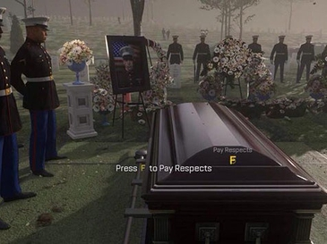
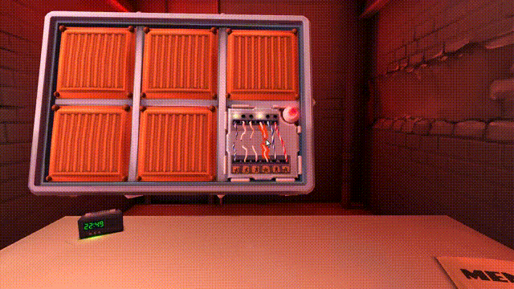
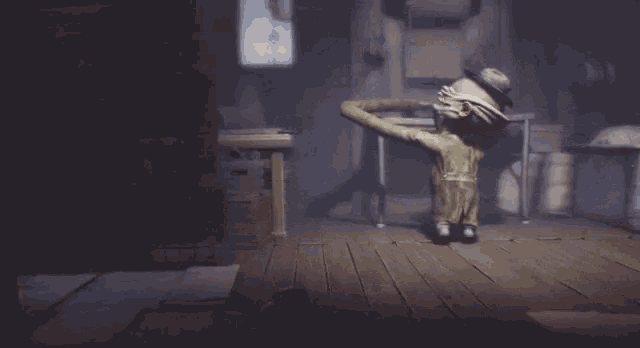
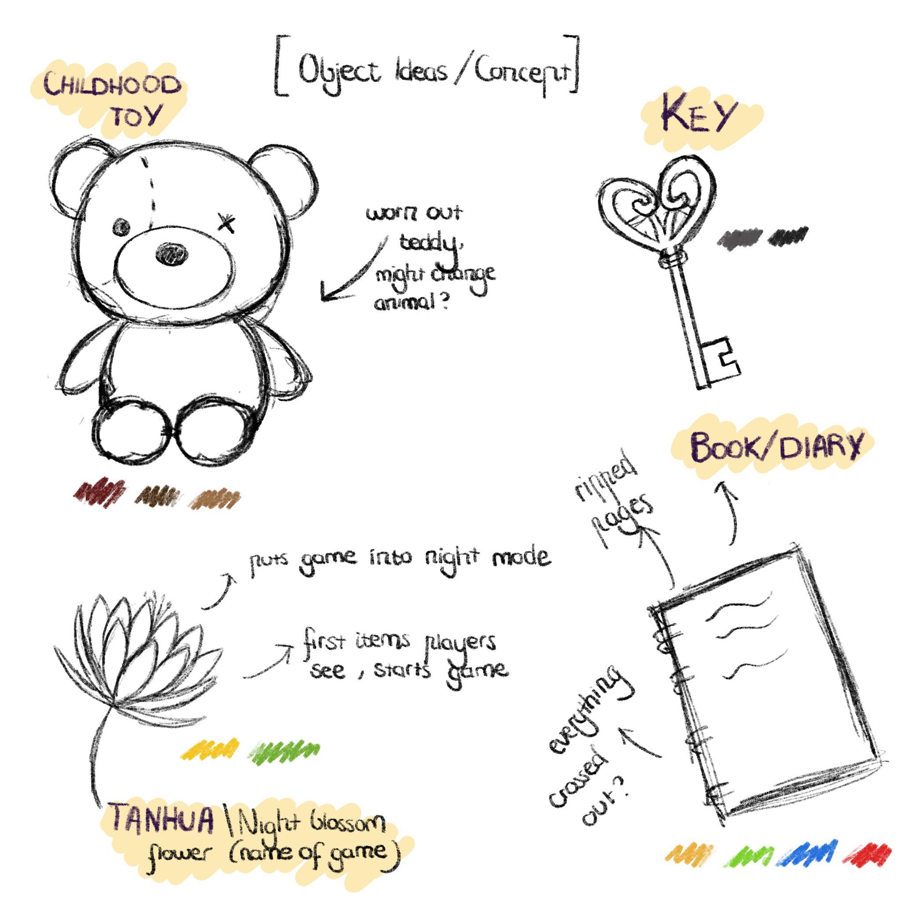
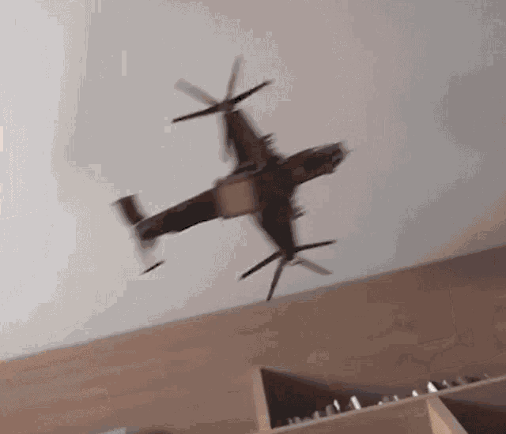
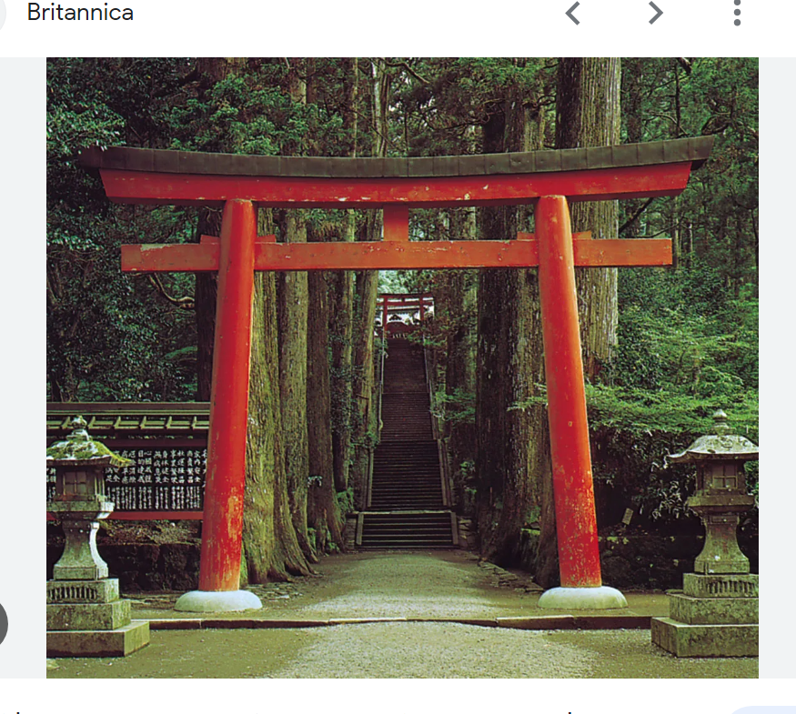
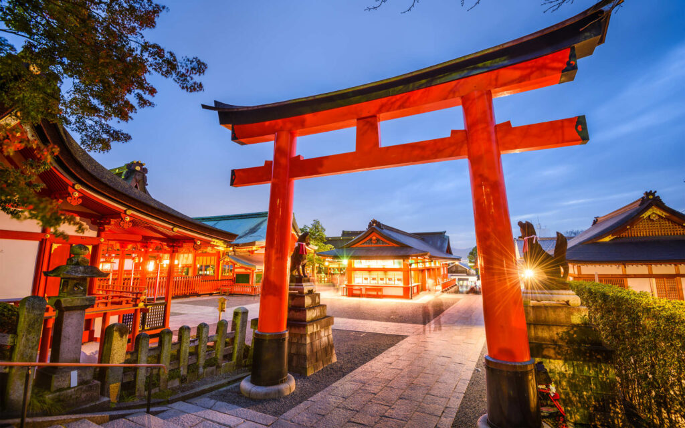
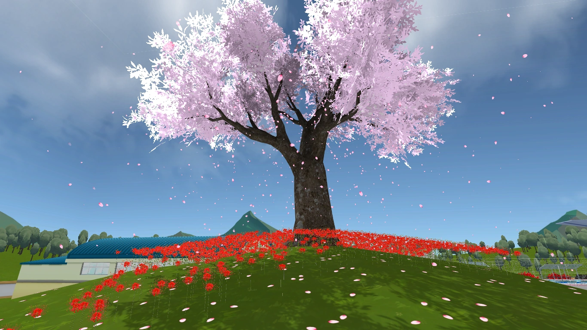
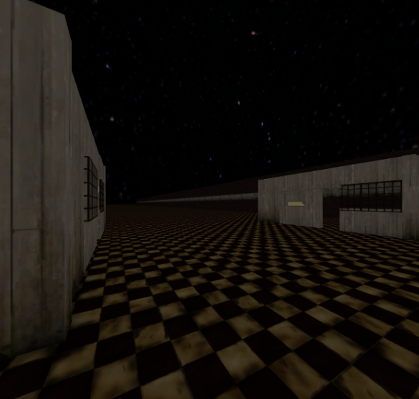
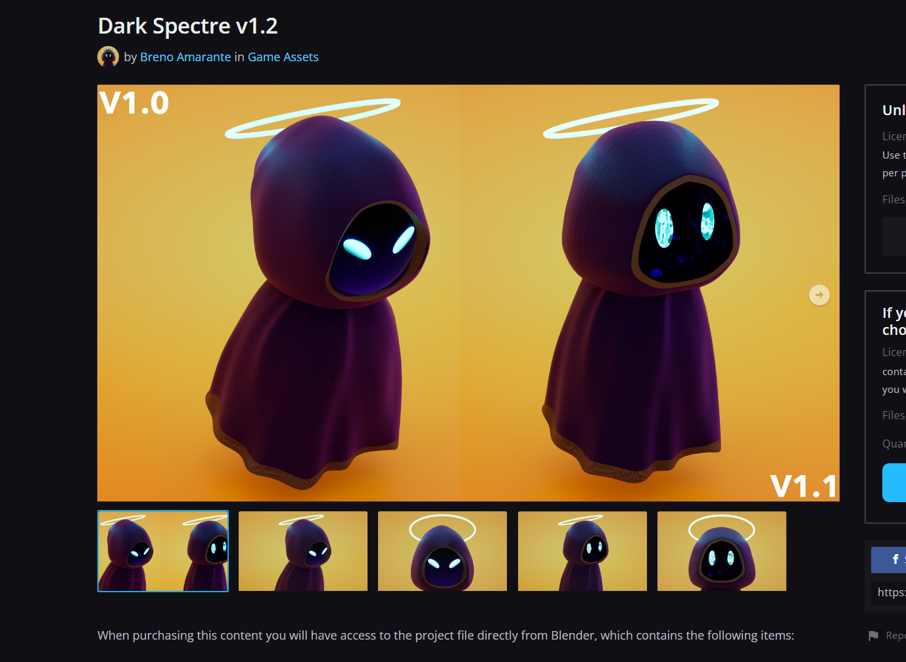

# Game Design Document (GDD)

### Table of contents
- [Game Design Document (GDD)](#game-design-document-gdd)
    - [Table of contents](#table-of-contents)
    - [1.0 Game Overview](#10-game-overview)
      - [1.1 Core Concept](#11-core-concept)
      - [1.2 Genre](#12-genre)
      - [1.3 Target Audience](#13-target-audience)
      - [1.4 Unique Selling Points (USPs):](#14-unique-selling-points-usps)
    - [2.0 Story and Narrative](#20-story-and-narrative)
      - [2.1 Backstory:](#21-backstory)
      - [2.2 Characters:](#22-characters)
    - [3.0 Gameplay and Mechanics](#30-gameplay-and-mechanics)
      - [3.1 Player Perspective:](#31-player-perspective)
      - [3.2 Controls:](#32-controls)
      - [3.3 Progression:](#33-progression)
      - [3.4 Gameplay Mechanics:](#34-gameplay-mechanics)
    - [4.0 Levels and World Design](#40-levels-and-world-design)
    - [5.0 Art and Audio](#50-art-and-audio)
      - [5.1 Art Style](#51-art-style)
      - [5.2 Sound and Music](#52-sound-and-music)
      - [5.3 Assets](#53-assets)
    - [6.0 User Interface (UI)](#60-user-interface-ui)
    - [7.0 Technology and Tools](#70-technology-and-tools)
      - [7.1  Game Engine:](#71--game-engine)
      - [7.2 Programming:](#72-programming)
      - [7.3 Version Control:](#73-version-control)
    - [8.0 Team Communication, Timelines and Task Assignment](#80-team-communication-timelines-and-task-assignment)
      - [8.1 Communication Channels:](#81-communication-channels)
      - [8.2 Task Management:](#82-task-management)
    - [9.0 Possible Challenges](#90-possible-challenges)
  - [style references:](#style-references)
    - [Using Images](#using-images)
    - [References](#references)

  

## 1.0 Game Overview

#### 1.1 Core Concept
_The Night Blossom_ is a first person survival horror game in which players must test their ability to work quickly and intelligently to outspeed a pursuing creature. The player is a human who’s job is to escape and survive through completing a set of tasks before they are caught. 

#### 1.2 Genre
This game is a survival game which implements strategy and horror elements. Some games in this genre are Resident Evil, Silent Hill and Among Us which task players with puzzles and strategy in order to win the game. The concept of our game was inspired by works like Poppys Playtime and Doki Doki Literature Club which adopt softer and cute designs that switch over to darker undertones. 

#### 1.3 Target Audience
Our game targets those who seek immersive, fast-paced and thrilling experiences where they can be challenged with puzzles and tasks. 

#### 1.4 Unique Selling Points (USPs):
_The Night Blossom_ offers a unique gameplay by blending elements of Japanese design and horror. Our game, unlike most horror games, initially presents players with a heartwarming prologue, exuding optimism and joy, only to swiftly transition into a more ominous and tension-filled gameplay experience. 

The game utilises a learning AI monster that changes its route depending on user interaction within the gameplay. This creates a different experience each time the game is played allows for an overall more menacing and unpredictable dynamic. 

  

## 2.0 Story and Narrative

#### 2.1 Backstory:
Awakening before a shrine gate, our main character finds themselves alone in a world with nothing but a flower. As they walk through the gate the day turns to night and the atmosphere changes. Our main character is now confronted by a shadowed entity that seeks to destroy them. Without any understanding of what is happening they try to escape and find items throughout the temple that seem to stunt the enemy. 

The entity chasing them seems to be affected by the items and each item gives a strange familiarity to the main character. As the player progresses through the game we learn that these items are the main characters' childhood toys revealing a connection to the shadowed entity. Once all 3 items are delivered and daytime is reached, it is revealed that the monster is the very embodiment of the main character themselves. The revelation comes to the realisation that the main characters themselves have died and are experiencing a manifestation of the main character's unresolved past and regrets. 

Our story encapsulates the journey of self-discovery and redemption. Through the game character players are immersed into an enigmatic world prompted with much symbolism and thought. Each item represents different regrets encouraging players to think and possibly even reflect on their own experiences and regrets. 

#### 2.2 Characters:
The main character is the only good character within the world. There is also one other entity which is an evil spirit that chases them throughout the game. The spirit is a shrouded entity that is covered in a dark cloak. The player cannot directly see the monster's face, amplifying the fear and terror factor within the game. The entity's motivation within the game is to chase and kill the main character whereas the main character's goal is to escape and survive against it. 

Our main character is a deceased ghost that is unable to die due to their regrets and past. The spirit exists as a torment that binds our main character to earth not letting them pass due to the weight of their unfinished business. 

## 3.0 Gameplay and Mechanics

#### 3.1 Player Perspective:
The game offers a first-person perspective, immersing players directly into the vibrant beauty of the festival and, subsequently, the chilling atmosphere of the cursed estate. The camera is dynamic and can be moved around freely by the player, offering a 360-degree view of their surroundings. The player's character is not visible on-screen, enhancing immersion, although objects like the main character’s camera might occasionally come into view, especially when interacting with certain elements.

#### 3.2 Controls:

- W, A, S, D: Movement controls.
- Q, E: peeking mechanism 
- Mouse: Look around/aim.
- F: Interact with an object
- Spacebar: Jump.
- Shift: Run (limited stamina to prevent overuse).
- ESC: Pause menu.

The interaction is intuitive. Approach an object, if it’s interactable, an icon will appear, prompting the player to press F or left mouse button.

  
  
  

#### 3.3 Progression:
The game begins in a calm morning environment where the player is guided to walk through shrine gates to deliver a flower. This will trigger the game to switch to a much faster and dark environment where it is now night time. This officially starts the game where the player is now chased by a spirit 

The player must outrun this spirit to win the game. The player will lose if they are caught by the spirit and can only survive through collecting and finding items that stunt the spirit. Throughout the gameplay they are chased by a shadowed entity and given the task to deliver 3 items to the centre tree in order to receive buffs that help them survive. If the player stays alive for 5 minutes (until the sun comes out) they win the game.

The game will progressively get harder as the entity gets progressively faster forcing players to find items faster. There is no direct scoring system however the focus lies on the players survival and engagement with the evolving narrative through item collection. 

The player is rewarded with easter eggs and secrets when collecting lore times, so they are motivated to replay the game and collect all items in order to further understand the story. There is also a lot of possibility for different endings or plotlines given different items promoting the player to keep playing.

  
  

#### 3.4 Gameplay Mechanics:

Time Survival: A persistent 5-minute timer. The urgency pushes players to act quickly, balancing haste with careful observation.

**Puzzle-solving**: Ranging from simple object placements to deciphering cryptic messages. Some puzzles might require players to recall earlier details or backtrack to previously explored areas.

**Stealth**: players need to avoid detection, using the environment to hide or player can peek around the corner to check for surroundings without being detected even if the player is in a line of sight of the villain

**Lore Collection**: Optional collectibles that provide insights into the game's backstory. These also serve as indirect hints for some puzzles.

The core mechanics revolve around the tense duality of exploration and evasion. While the temple/spirit invites players to uncover its secrets, it also relentlessly pursues them, creating a constant push and pull between curiosity and survival. The "time survival" mechanic amplifies this tension, ensuring that every second counts.

  
  

**Monster behaviour and mechanics:**

At the start of the game, the monster is programmed to spawn at random locations, always maintaining a certain distance from the player. The monster operates on a few preset movement routes and starts off at a slow speed. However, if the player is detected by the monster, its behaviour shifts to a direct pursuit mode. As the game's internal clock approaches sunrise, the monster's speed is algorithmically increased. The player has a counter-mechanism; each time they deliver a designated item, the monster receives a programmed debuff, affecting its performance. If the monster successfully reaches the player, the game registers it as a player's death.

  

## 4.0 Levels and World Design

**Game world**

The game world would be 3D, with the main game taking place in a maze-like Japanese shrine. The player will attempt to navigate through the shrine while solving puzzles and avoiding the enemy. No minimap will be provided to the player as it will undermine the maze/horror elements of the game. Although, pieces of a limited map could be given to the player as a reward for solving puzzles.

**Objects**

The main objects in this game are the items that the main character must deliver to the central tree to stunt the entity. These items all involve puzzles in order to retrieve them and have their own lore attached to them. When an item is collected a piece of dialogue from the player is prompted. 

- Book: A diary of some sort with blacked out pages 
- Flower: The flower that the character first finds. Triggers the game to switch to night mode. 
- Key: Seems to be like a key to a box of some sort 
- Doll: A teddy bear that seems quite worn out.

  

**Physics**

The game employs physics reminiscent of the real world to heighten the horror experience's immersion. This means players can expect a movement speed that mirrors realistic human pacing and a gravitational pull akin to Earth's. Such design ensures that character interactions with the environment, including collisions with objects, feel authentic. However, to streamline gameplay and mitigate the risk of disruptive bugs, items within the game are exempt from these physics effects.

  

## 5.0 Art and Audio

#### 5.1 Art Style
Our game implements the aesthetics found within Japanese shrines and temples. In the opening prologue we utilise a soft and delicate palette of pastel colours creating a sense of a peaceful and light environment similar to Figure 5A. As the game officially starts, we transition into a night mode which adopts a much darker palette with darker tones (Figure 5D). This invokes the essence of horror through deep colours such as dark red reflecting a blood like intensity. The overall world is set within a Japanese shrine (Figure 5A and 5B) which adopts a darker tone similar to Figure 5E once the game officially starts.

As the game follows the aesthetic of Japanese shrines, the structures follow sharp lines with curved tops. Textures in the game are relatively simplistic and to maximise the key elements within the game. This style uses a flat shading with bold outlines.

  

Figure 5A: Shrine Gates

  

Figure 5B: Shrine Layout 

  

Figure 5C: Cherry Blossom Tree

  

Figure 5D: Dark brown palettes created for night environment 

  

Figure 5E: Darker Shrine 

#### 5.2 Sound and Music
To weave in with the Japan aesthetics, we incorporated Asian inspired horror music. This acts as background music throughout the entire gameplay immersing players into the atmosphere. When the entity catches up to the player we employ a jumpscare noise that effectively startles and shocks the player. This auditory experience amplifies the fear aligning with the overarching theme enhancing the immersion. 

When puzzles are solved there is a small bell noise confirming the player has successfully completed and acquired the item. 

#### 5.3 Assets
Below are assets we found for our game. These assets aid the development of our game including the world design and sound design.

**Assets for the environment**: 

[ * [Simple Shrine Pack | 3D Historic | Unity Asset Store] (https://assetstore.unity.com/packages/3d/environments/historic/simple-shrine-pack-175272)](https://assetstore.unity.com/packages/3d/environments/historic/simple-shrine-pack-175272)

**Sound: Environment / BGM**: 
https://www.youtube.com/watch?v=PzZihoS2VIs

https://www.youtube.com/watch?v=CTKo9CKswW4&list=PLZjyFn4dv3eL7Eazi1gIkUbeBy9S8hPPc

**Sound: Jumpscare (when monster catches you)** : 

https://www.youtube.com/watch?v=SpvkvVRtL7Q

**Sound: for when you solve puzzle/place item**: 

https://www.youtube.com/watch?v=_ovvWMq2SKw

**Monster base**: 

[Dark Spectre v1.2 | Game Assets](https://www.artstation.com/marketplace/p/3pBqo/dark-spectre-v1-2)

  

## 6.0 User Interface (UI)

**Main HUD (Head-Up Display) during gameplay:**

**Stamina Bar**: A thin, translucent bar at the bottom-left corner that depletes as the player runs. It's designed to look like an ink-brush stroke, fading as stamina decreases.
	
Main HUD will follow the generic aesthetic of the usual game Minecraft’s UI as It tends to contain all the necessary information with simplicity. However, we plan on changing the overall UI aesthetics to a more subtle horror theme with less rigidity to give the player a sense of unbalance and lurking fear while playing the game. 

  

**Main Menu**:

- Background: undecided but something happy and positive yet subtle hint of darkness/horror for the game theme
- Options listed vertically on the left, written in elegant calligraphy:
  - Start Game
  - Options
  - Load Game
  - Credits	
  - Exit

Each option, when hovered over, will be highlighted in a certain manner. 

**Pause Menu**:

- A semi-transparent black overlay dims the game in the background.
- Options listed in the centre:
  - Resume
  - Options
  - Main Menu
  - Quit

The overall menu options aesthetic will follow as  with the subtle white and glowy text with interesting font creates a vibe that can potentially make the player uncomfortable before starting the game. However, we are planning on giving the menu UI a twist where the major aesthetic will be pleasant and oriental, while hiding hints of contrasting elements to contain the overall theme of the game. We will be incorporating a lot of asian/japanese theme design which represents the game’s direction. 

  

## 7.0 Technology and Tools

#### 7.1  Game Engine:
Unity (Version: 2023.1)

Reason: Unity is a versatile game engine that supports a wide range of platforms. Its built-in support for WebGL ensures seamless deployment for web platforms. Unity's rich ecosystem, asset store, and extensive community support also make it a top choice for game development.

#### 7.2 Programming:
C# (within Unity)

Reason: C# is Unity's primary scripting language. It offers a robust and object-oriented approach, enabling developers to create efficient and maintainable code for game mechanics and interactions.

#### 7.3 Version Control:
GitHub
Reason: GitHub is an industry-standard tool for version control. It not only allows for easy collaboration between team members but also provides a secure backup of the project. Integration with Unity is seamless, ensuring that changes can be tracked and managed efficiently.

## 8.0 Team Communication, Timelines and Task Assignment

#### 8.1 Communication Channels:
Facebook Messenger:

Facebook Messenger will be our main tool of communication as it is a communication tool everyone in the group is familiar with while also being able to keep track with the newest notifications or updates from other members of the group.
This tool will be mainly responsible for discussing and bouncing ideas between the team members while also keeping track of everyone’s progress throughout the project.

#### 8.2 Task Management:

Trello

Boards: Create one whole board for the project that will contain different lists for different aspects of the project
Lists: Each list will represent different aspects of the game such as “Game mechanics” or “Puzzle”
Cards: Individual tasks get created as cards. Each card should have:
Detailed description 
Assignee(s)
Due date

Checklists
Labels (e.g. “In Progress” ,”Backlog”)
Protocols:
When a member starts a task, they move its card to "In Progress."
Any issues or roadblocks related to a task should be added as comments in the respective card.
Once a task is done, the card moves to "Testing." Post-testing, if everything is satisfactory, it proceeds to "Completed."
Team members should regularly update their card status to ensure everyone is aware of the game's progress

## 9.0 Possible Challenges

Challenge: Puzzle mechanics might be hard to implement

Solution:   Limit the scope/type of puzzles

Challenge: Limited free assets available for the art style / items / characters we want to create

Solution:
Create our own assets using blender
Buy assets
Modify the base assets we find 

Challenge: AI of the enemy could be too hard to implement

Solution:
Limit what the monster can do
Use 3rd party libraries
