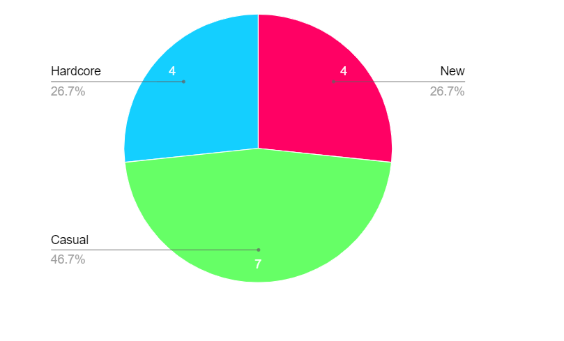
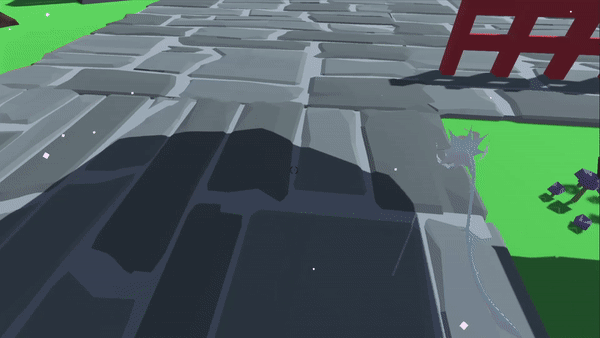
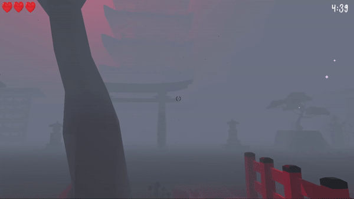
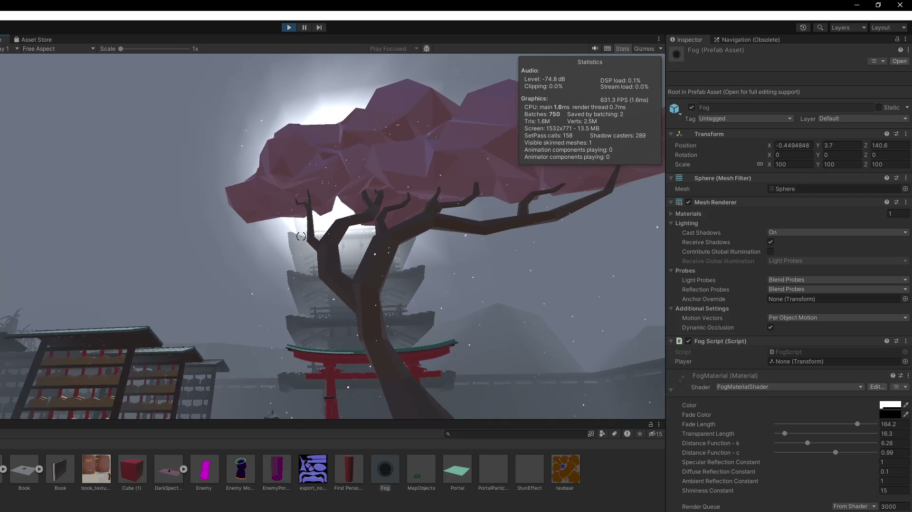
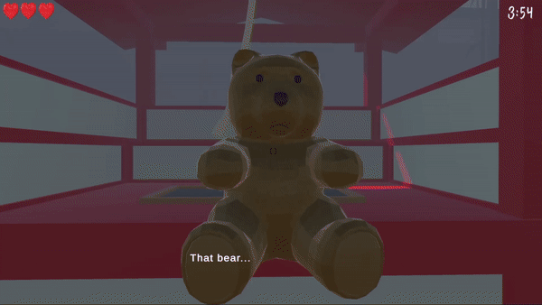
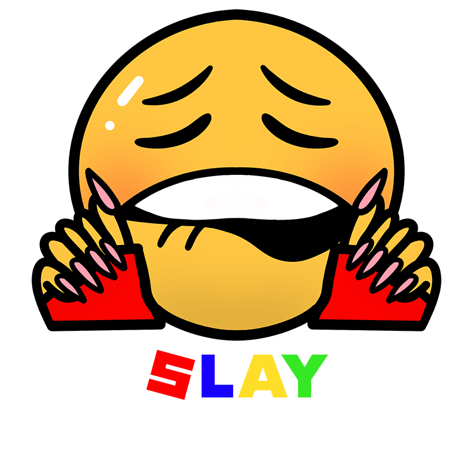

# Project 2 Report

Read the [project 2
specification](https://github.com/COMP30019/Project-2-Specification) for
details on what needs to be covered here. You may modify this template as you see fit, but please
keep the same general structure and headings.

Remember that you must also continue to maintain the Game Design Document (GDD)
in the `GDD.md` file (as discussed in the specification). We've provided a
placeholder for it [here](GDD.md).

## Table of Contents

* [Evaluation Plan](#evaluation-plan)
* [Evaluation Report](#evaluation-report)
* [Shaders and Special Effects](#shaders-and-special-effects)
* [Summary of Contributions](#summary-of-contributions)
* [References and External Resources](#references-and-external-resources)

## Evaluation Plan

### 1.0 Goals with evaluation

The primary objective of this evaluation is to enhance the game by taking insights from real-life players. During the development stage, particular bugs or issues can be overlooked and this evaluation serves as a mechanism to identify, address and improve upon them.

Furthermore we seek to enhance the overall entertainment value of the game itself by actively incorporating player feedback. Our aim is to make the game not just technically sound but also as enjoyable and engaging as it can be.

--- 

### 2.0 Evaluation techniques: Which evaluation techniques will you use and why? What tasks will you ask participants to perform?

In order to comprehensively evaluate the game we will employ a range of assessment techniques. 
Players will rate their fear levels during gameplay and provide a gauge for the games immersion and suspenseful elements. 
Additionally we will inquire about overall satisfaction throughout the game to gauge user experience. 

Play testing will be done where players can provide insights. Play tests can be done once or multiple times.  We will ask participants to explore the map as well as try to survive the game for the entire 5 minutes.

---

### 3.0 Participants: How will you recruit participants? What qualifying criteria will you use to ensure that they are representative of your target audience?

Our game follows a horror theme and due to this we aim for an older audience that likes the fear factor. We aim to find participants through friends and family as well as possibly online on online gaming forums that are horror themed targeted. 

Some qualifying criterias will be:

**Age**: Due to horror aspect 15+ is preferred  
**Previous gaming experience**: Whether or not they regularly play games or not  
**Interest in the horror genre**: This is important as this is our target audience

Target audience is those who love survival horror games with an emphasis on narrative. Ensure participants have played at least one game from the genre in the past year. They should range from casual to hardcore gamers to capture a broad spectrum of feedback.

---

### 4.0 Data collection: What sort of data is being collected? How will you collect the data? What tools will you use?

We will collect data on these certain features:

Completion status: If they were able to survive the 5 minutes or not  
Ratings and feedback: overall satisfaction and enjoyment of the game  
Fear factor: Rating whether or not the horror theme was implemented well or not 

We plan on collecting the data in both ways; quantitative and qualitative. This involves aspects such as player feedback and comments, or game completion time, number of deaths and more. 

Data will be collected using game analytics tools to capture gameplay metrics automatically, and for feedback we will be utilising survey platforms for focus groups.

Tools we will be using include Unity Analytics for in-game data, and SurveyMonkey or Google Forms for feedback collection.

---

### 5.0 Data analysis: How will you analyse the data? What metrics will you use to evaluate your game, and provide a basis for making changes?

Metrics will be evaluated accordingly:

**5.1 Quantitative Analysis**  
Survival rate: Percentage of players able to complete game  
Fear ratings: Whether or not they found it suspenseful and scary  
Satisfaction: Average rating of game  
Number of tries to complete  
Number of items collected  

**5.2 Qualitative Analysis**  
Categorise feedback into themes (prioritise based on frequency and severity of issues mentioned)  
Gameplay  
Story  
Graphics  

**5.3 Metrics**  
Player retention rate  
Overall satisfaction score  
Perceived difficulty level  
Narrative engagement score  

According to these we will analyse the data and identify patterns or key areas that need improvements. 

---

### 6.0 Timeline: What is your timeline for completing the evaluation? When will you make changes to the game?

**Day 1-2**: Recruitment and evaluation of participants  
**Day 3-4**: Gameplay sessions and data collection  
**Day 5-6**: Data analysis and reports  
**Day 7+**: Changes and improvements to the game.  

---

### 7.0 Responsibilities: Who is responsible for each task? How will you ensure that everyone contributes equally?

#### 7.1 Evaluation organisation: 

Playtesting: Game testers and volunteer participants.

Feedback Collection: Kaiyuan Cui

Data Analysis: John An

Participant recruitment: Natasha Ngo

Implementation of Changes: Developers/ Full team members

#### 7.2 Organisation for code and game changes: 

The work will be distributed into 3 parts which will be allocated accordingly. 

MonsterAI: Kaiyuan Cui

Quality of Life/Game immersion: Natasha Ngo

Game mechanics: John An

This allows for even contribution and members will help and contribute to the other parts when needed. We will ensure everyone has similarly distributed workload by actively communicating about the workflow and the progress to make sure no one is over/underworking during the evaluation process.

## Evaluation Report

**Evaluation Report**

The main goal of our evaluation was to improve “Night Blossom” by utilising feedback from real life players. Here we used the Query evaluation technique through asking a very carefully selected group of people to answer a range of questions. 

**1.0 Participants/Demographic information**

Our players were carefully selected among a bunch in order to ensure the most useful information for our target audience. We specifically search for gamers who were into the horror genre and had played a horror game at least once in the past year.

New gamers, casual gamers and hardcore were chosen to help Night Blossom target a wider audience. In this case hardcore indicated playing games daily or every two days. Casual was at least once a fortnight and then new gamers indicated those who only played very solemnly (once a month or less).

 Of the 15 players chosen, 4 chosen were **new**,  7 were **casual** gamers and 4  considered themselves more **hardcore**. 

  

Both genders were equally chosen with 8 identifying as male and 7 identifying as female.

**Data**

**1.2 Data collection**

A google form was sent to 15 gamers who played the game. We asked about: 

**Demographic information:** As shown above. Players are asked about experience as a gamer (new, casual, hardcore) and the gender at which they identify. 

**Completion status:** If they were able to survive the 5 minutes or not. Answered with a yes or no.

**Ratings and feedback:** Overall satisfaction and enjoyment of the game on a scale from 1 to 5.

**Fear factor:** Rating whether or not the horror theme was implemented well or not from 1 to 5.

**Number of tries to win:** How many plays until a player won (if they managed to within a reasonable amount of tries)

**How many times were you hit if you won?** From 0 to 2 as 3 hits indicates the player has lost the game.

**What could we improve on?** Short answer allowing players to add any additional comments and advice.

**3.0 Data Analysis**

**3.1 Quantitative Analysis**

**Survival rate:** Night Blossom had a survival rate or otherwise completion rate of 85.7% indicating the game is within a reasonable enough difficulty.

  

**Ratings and feedback:** Overall rates average at 4.7 out of 5 indicating the players enjoyed their overall experience and gameplay of Night blossom.

**Fear factor:** Overall rates average 3.7 out of 5 indicating the game was scary but with a decent room for improvement.

**Difficulty:**

**Number of tries to complete:** 
The average number of tries to complete the game was **2.7** indicating a moderate level of challenge. Players typically required multiple attempts to succeed, suggesting a balanced level of difficulty that encourages replay. 

**How many times were you hit if you won?** 
Among players who were able to win the game, they were hit on average **1.2** highlighting an expecting number of encounters. This underscores that successful players navigated the game efficiently once they were able to play a few times ( as indicated with previous number of tries to complete).

**5.2 Qualitative Analysis**

**Open feedback:** What could be improved on?

**Gameplay:** A player mentioned that the game was too repetitive and suggested item spawns could be randomised. This was taken into consideration by Team Slay and adopted for milestone 3 to allow for more difficulty and replayability.

**Story:** One player asked to add more story which we took note of. Story was in the works of expanding regardless however we pushed it to be further priority.

**Fear factor:** Majority of comments made were about fear factor and mentioned adding more scary features such as jumpscares and more. This was taken strongly in consideration as the main focus of the game is the horror and fear aspect.

**Improvements and changes for game:**

**Gameplay:** Items will now be randomised allowing for replayability and more difficulty 

**Story:** More dialogue has been added and a final ending cutscene to finalise and wrap up the game added

**Fear factor:** Multiple features were added here. Jumpscares were added at points the players picked items to create a sense of vulnerability and intensity. Moreover more sound effects including increasing heart beat around monster and jumpscare sounds added. Screen distortion was added upon damage creating further fear among players. 

**Conclusion:**

Overall the evaluation process served as a critical juncture in the games development. It offered a more profound understanding of how to improve NIght Blossom including any possible bugs and issues that we may not have spotted in our game plays. The insights from this assessment became instrumental in guiding our next processes and in refining the game enabling us to implement targeted enhancements and optimizations that significantly contributed to the overall player experience of Night Blossom.

## Shaders and Special Effects

### [Fog Shader](Assets/Shaders/FogMaterialShader.shader)

This shader is created to provide a global fog effect after the main game starts (after the intro section). We use a material, [Fog Material](Assets/Material/FogMaterial.mat), to parameterise the shader and control the fog effect. The parameters are as follows:

- _Color: This property defines the base colour of the fog.

- _FadeColor: This property defines the colour that the fog fades into as the object gets closer. By setting this to a colour that contrasts with the base colour, we can create a silhouette effect for objects within the fog.

- _FadeLength: Controls the depth of the fading section in the fog.

- _TransparentLength: Controls the depth of the transparent section in the fog, allowing close objects to be fully visible within the fog

- _LightSourceDist: The distance from the camera to the light source, affects how the specular light behaves in the fog. Adjusting this simulates the effect of the light source on the fog colour at different distances.

- _K and _C: These properties are used to define the mathematical function that calculates how the fog effect changes over distance. The equation used is 2^k(d-c), where ‘d’ is the normalised distance of the object to the camera, and  'k' and 'c' control the rate of change and the offset, respectively.

- Gouraud shading constants:
  - _Ks: Specular reflection constant.
  - _Kd: Diffuse reflection constant.
  - _Ka: Ambient reflection constant.
  - _Alpha: Shininess constant for specular highlight.

With the appropriate parameters set, an object with “FogMaterial” applied will appear as a shroud of fog. However, we decided that it might fit the theme of our game better if the whole map appeared to be covered in fog, so instead, an object with “FogMaterial” applied covers the main camera and follows it when the fog is required. This object acts as essentially a filter, applying the effect to everything the camera sees.

**Implementation details**

Vertex Shader

The vertex shader implements a modified version of Gouraud Shading. Instead of calculating the specular highlight with the direction of the light source’s reflection, it is calculated using just the direction of the light source (i.e. the intensity of the highlight increases as the direction from the camera to the vertex gets closer to the direction from the camera to the light source). The color of the specular highlight is then passed on to the fragment shader separately for blending with the base fog color. This aims to create the effect of the light source shining through the fog (instead of reflecting off it).

Fragment Shader

The fragment shader calculates the depth of the fragment and then determines its final colour by blending the base fog colour, the ‘fade’ colour, the highlight colour, and an appropriate amount of transparency based on the parameters and a distance function. This results in the material fading the colours of the objects behind it, creating a fog-like effect.

### [Distortion Shader](Assets/Shaders/DistortionShader.shader)

The shader is created to enhance the appearance of the portal objects in our game. The main effects provided by this shader are:
  1. Distorting objects in the background
  2. Dynamic wave effect
  3. Variable transparency based on viewing angle

Currently, [Portal Material](Assets/Material/PortalMaterial.mat) and [Enemy Portal Material](Assets/Material/EnemyPortalMaterial.mat) utilise this shader with different parameters. The parameters are as follows:
- _Color: The base color of the portal.

- _DistortionSpeedX and _DistortionSpeedY: These control the speed of the portal's distortions along the X and Y axes. 

- _DistortionFreqX and _DistortionFreqY: These parameters determine the frequency of distortions in the X and Y directions. 

- _DistortionScaleX and _DistortionScaleY: The scales of the distortions along the X and Y axes. 

	

- _Lx,  _Ly, _nx and _ny: parameters of the wave function, based on [the wave function of a quantum particle in a box](https://chem.libretexts.org/Bookshelves/Physical_and_Theoretical_Chemistry_Textbook_Maps/Physical_Chemistry_(LibreTexts)/03%3A_The_Schrodinger_Equation_and_a_Particle_in_a_Box/3.09%3A_A_Particle_in_a_Three-Dimensional_Box)

    By setting these to the appropriate values based on the size and shape of the material, we can achieve effects similar to this:
    

    (However, due to the low amount of vertices in the default unity plane, the resulting waves are not as smooth)

- _TransparentAreaFactor: Controls the area / fading behaviour of the transparent section within the portal. 

Having these parameters allows us to fine-tune the appearance of the portals to fit the aesthetics of our game.

**Implementation details**

Vertex Shader
	
Most of the heavy lifting is done in the vertex shader. It first computes the displacement of the vertex by applying the previously mentioned wave function to create spatial distortions within portals. Next, it adds another displacement to the vertex’s on-screen position based on another wave function, passing it to the fragment shader. Finally, the transparency of the vertex is determined by the angle between the camera and the portal's surface normal (computed with a function of the dot product between the vector from the camera to the vertex and the normal vector)

Fragment Shader

The fragment shader takes the distorted on-screen positions, and finds the corresponding texture behind the object, tinting it based on the material colour and transparency to use as the final color of the fragment. The resulting effect is portals that appear distorted in multiple dimensions, with a transparent/undistorted part facing the player, creating a mysterious yet inviting look.

### TODO: Particle system

## Summary of Contributions
Objective: Build a 5 minute survival horror game 

  

Developing a game with a three-member team demanded effective workload distribution. To ensure equitable division, an initial meeting was conducted to deliberate on each member's strengths and weaknesses. This discussion led to an understanding of individual preferences and skill sets, culminating in the subdivision of three primary sections: Design/Story, Gameplay, and Monster development. Although each member primarily focused on their designated area, they also contributed to other aspects when needed. This collaborative approach facilitated a well-timed and proficient project completion, enabling every team member to showcase their expertise.

**Team Leader/ Design:** Natasha Ngo

Natasha focused on the design of the game including story and map design. She worked carefully with features like dialogue, visual design and sound design. Focus was also done on ensuring tasks were completed on time and updating trello accordingly and assigning priorities. This member also focused on quality of life features that would make the game overall more seamless and immersive for the player. These included things such as jumpscares noises and pulsating blood on the screen when damaged.

This member focused on other points as well like the main menu and end scenes with dialogue; ensuring the game started and ended smoothly whilst staying interesting and engaging for the player.

**Monster/Shaders:** Kaiyuan Cui

Kai was the main developer for the monster artificial intelligence. He worked with creating a monster that could effectively chase the main character as well as follow a path.  This member also focused heavily on the shaders and particles that were used on this project including features such as fog, portals and blood effects. These overall added to the creepy atmosphere which was very crucial to the horror theme.

In addition to the monster’s behaviour , Kai put considerable efforts towards communicating with the team members and ensuring the game development ran smoothly. 

**Gameplay/Player movement:** John An

John led the development of gameplay mechanics, concentrating on essential player movements such as peeking, running, picking up, and placing items. His expertise extended to creating random spawn points for items, enhancing the game's replay value and future playability.

He actively supported other team members, playing a pivotal role in ensuring a seamless start-to-finish gameplay experience. His contributions were instrumental in orchestrating the game's initiation and conclusion with precision and accuracy. John was effective at communicating and worked very well with other team members. 

**Conclusion:**

The success of our project can be attributed to the synergistic collaboration among team members, their unwavering dedication, and their willingness to step beyond their designated roles to ensure a comprehensive and compelling game. By leveraging each member's strengths and their collective commitment to the game's vision, we successfully created a horror experience that captivates and challenges players.

## References and External Resources

**Monster Assets:**

https://www.artstation.com/marketplace/p/3pBqo/dark-spectre-v1-2

**Design Assets:**

**Flower:** https://www.cgtrader.com/free-3d-models/plant/flower/red-rose--3?fbclid=IwAR2JGYuvdvuPvADDrchtXlgywZaoDknjxisliQmbAAeazSGRLwm1e-KcAvg

**Key:** https://www.turbosquid.com/3d-models/3d-liberty-door-handles-key-1160ch2020-model-2018729?fbclid=IwAR0a2aRcNPQ9dcqZI1RoIDnk4uDDyxZGeO0fowo7v6o4ovHUpJO57MeW5vY

**Teddy Bear:** https://www.turbosquid.com/3d-models/teddy-bear-3d-model-1256850?fbclid=IwAR0rA8mEKgjcAzO72OY4dD9u4GHhF1aYoHnz5Zq7b_cIkjiv-qmT5kyzSX4

**Book:** https://www.turbosquid.com/3d-models/book-low-poly-model-3d-model-1814524?fbclid=IwAR22YzuhtvMrEKYrvaSpNUokF57n-Py5qvnyAtqu4_jQPEX2FhRvuAtcgUw

**Gamemap:** 

https://assetstore.unity.com/packages/3d/environments/polygon-samurai-low-poly-3d-art-by-synty-89551

https://assetstore.unity.com/packages/3d/environments/historic/simple-shrine-pack-175272

**Blood prefab:** 
https://assetstore.unity.com/packages/2d/textures-materials/blood-splatter-decal-package-7518

**Audio:**

**BGM 1 Zen Garden:** https://www.fesliyanstudios.com/royalty-free-music/downloads-c/japanese-music/63?fbclid=IwAR0yi1wM_J5Al1Oc4zXoLw1v2SLkpoUmflGbxW4Ghd9-taKqLp3nvTTBUH4

**BGM 2 During game:** https://www.youtube.com/watch?v=WgY6aWtJ-zg 

**Jumpscare:** https://www.youtube.com/watch?v=0m3pxkOpxwc

**Fonts:**

https://fontmeme.com/fonts/little-nightmare-font/

